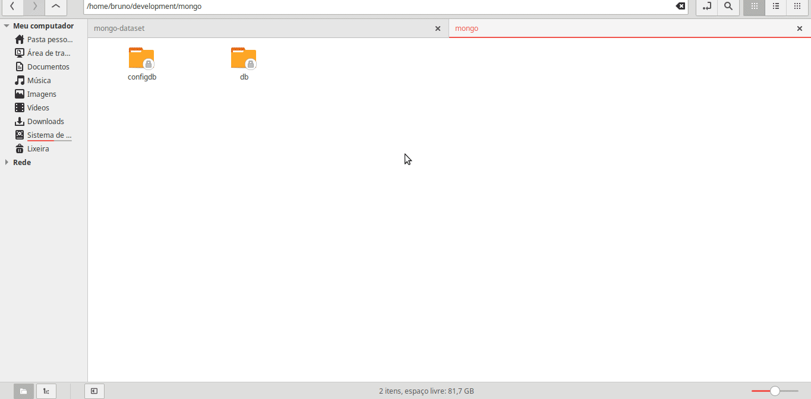

# geo-converter

## running mongo in docker
```
docker run -p 27017:27017 --name nosql-mongo -v /home/USER/development/mongo:/data/ -d mongo
```
## downloading the dataset
```
git clone https://github.com/gustavoleitao/mongo-dataset.git
```
## after downloading copy the file to mongo volume folder and import the dataset to your mongodb
```
mongoimport --db geoconv --collection restaurants --drop --file /data/primer-dataset.json
```
## command to create 2dsphere
```
 db.restaurants.createIndex( { location : "2dsphere" } )
```
### Import Dataset Demonstration


## project setup
```
npm install
```
## running the project
```
npm start
```
